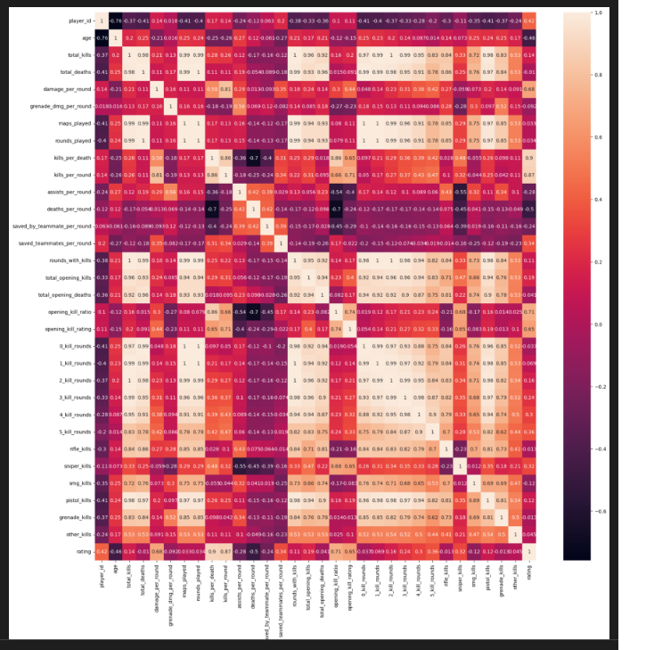
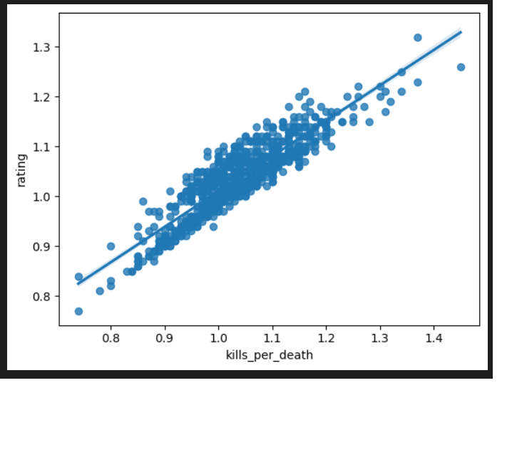
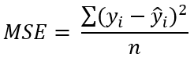

# Laporan Proyek Machine Learning

### Nama : Ryan Anto Ramadhan

### Nim : 211351132

### Kelas : TIF Pagi B

## Domain Proyek


Counter strike go adalah sebuah permainan video bergenre first-person shooter yang populer di kalangan penggemar esports. Dalam permainan ini, pemain dapat memilih menjadi bagian dari tim teroris atau anti-teroris yang bertempur dalam berbagai mode dan peta. Dalam CS GO, ada suatu sistem rating yang akan menilai performa dari para pemain. Rating ini dapat digunakan sebagai acuan untuk meningkatkan skill, memilih strategi, atau mencari lawan yang sesuai dengan level pemain.

Namun masalahnya, para player tidak mengetahui faktor apa saja yang berpengaruh terhadap penilaian rating. Dengan perkembangan teknologi saat ini, kita bisa mengolah dataset yang berisi performa dan rating para player untuk kita jadikan solusi dari permaslahan diatas yaitu **Aplikasi Estimasi Rating Player CS:GO Berbasis Machine Leraning**.

## Business Understanding

### Problem Statements

- Player tidak tahu faktor apa saja yang berpengaruh terhadap penilaian rating.
- Player tidak tahu sisi mana saja yang harus dikembangkan dari permainan mereka untuk meningkatkan rating mereka.

### Goals

- Player dapat mengetahui rating permainan mereka berdasarkan beberapa faktor.
- Player dapat mengetaui kelemahan dan kekurangan mereka untuk dikembangkan agar meningkatkan rating mereka.

### Solution statements

- Membangun suatu sistem yang dapat mempelajari suatu data (Machine Learning) melakukan estimasi rating player cs:go
- Sistem berjalan dengan menggunakan metode Regresi Linear yang dinilai cocok untuk melakukan estimasi pada dataset ini.

## Data Understanding

Dataset yang digunakan berasal dari situs Kaggle. Dataset ini mengandung 811 entries dan 41 columns. Dataset ini didapat berdasarkan rekap data performa para pro players CS:GO.<br>

Link Dataset: [CS_GO Player Performance Dataset](https://www.kaggle.com/datasets/naumanaarif/csgo-pro-players-dataset/data).

### Variabel-variabel yang terdapat pada Dataset adalah sebagai berikut:

Karena terdapat variabel yang cukup banyak pada dataset ini, untuk meringkasnya, saya hanya akan mengambil beberapa variabel yang dirasa memiliki nilai yang menarik dan menjelaskannya.

- damage_per_rounds = Damage yang dihasilkan oleh pemain per-rounds
- kills_per_death = Rasio kills per-death player
- kills_per_round = Rasio kills per-round player
- saved_teammates_per_round = rata-rata penyelamatan team-mate yang dilakukan player per-round
- opening_kill_ratio = Rasio opening kill yang dilakukan player
- opening_kill_rating = rating opening kill yang dilakukan player.
- 4_kill_rounds = Jumlah round dengan 4 kill oleh pemain.
- 5_kill_rounds = Jumlah round dengan 4 kill oleh pemain.
- Rating = Rating player.

## Data Preparation

Pertama-tama import semua library yang dibutuhkan,

```bash
import pandas as pd
import numpy as np
import matplotlib.pypot as plt
import seaborn as sns
```

Setelah itu kita akan men-definsikan dataset menggunakan fungsi pada library pandas

```bash
df = pd.read_csv('csgo_players.csv')
pd.set_option('display.max_rows', 500)
pd.set_option('display.max_columns', 500)
pd.set_option('display.width', 1000)
```

Lalu kita akan melihat informasi mengenai dataset dengan syntax seperti dibawah:

```bash
df.info()
```

Dengan hasil sebagai berikut:

```bash
<class 'pandas.core.frame.DataFrame'>
RangeIndex: 811 entries, 0 to 810
Data columns (total 41 columns):
 #   Column                             Non-Null Count  Dtype
---  ------                             --------------  -----
 0   player_id                          811 non-null    int64
 1   nickname                           811 non-null    object
 2   real_name                          811 non-null    object
 3   age                                811 non-null    int64
 4   country                            811 non-null    object
 5   current_team                       514 non-null    object
 6   teams                              811 non-null    object
 7   total_kills                        811 non-null    int64
 8   total_deaths                       811 non-null    int64
 9   headshot_percentage                811 non-null    object
 10  damage_per_round                   811 non-null    float64
 11  grenade_dmg_per_round              811 non-null    float64
 12  maps_played                        811 non-null    int64
 13  rounds_played                      811 non-null    int64
 14  kills_per_death                    811 non-null    float64
 15  kills_per_round                    811 non-null    float64
 16  assists_per_round                  811 non-null    float64
 17  deaths_per_round                   811 non-null    float64
 18  saved_by_teammate_per_round        811 non-null    float64
 19  saved_teammates_per_round          811 non-null    float64
...
 39  other_kills                        811 non-null    int64
 40  rating                             811 non-null    float64
dtypes: float64(11), int64(21), object(9)
memory usage: 259.9+ KB
```

<br>

Kita juga akan melihat tingkat korelasi antar kolom



Korelasi antar kolom perlu diperhatikan guna memilih feature dengan tepat. Dari data diatas, label yang berpengaruh terhadap rating :
'damage_per_round','kills_per_death','kills_per_round','saved_teammates_per_round','opening_kill_ratio','opening_kill_rating','5_kill_rounds'

Selanjutnya memeriksa apakah ada data yang berisi nilai null pada dataset:

```bash
df.isna().sum()
```

Dengan hasil sebagai berikut:

```bash
player_id                            0
nickname                             0
real_name                            0
age                                  0
country                              0
current_team                        297
teams                                0
total_kills                          0
total_deaths                         0
headshot_percentage                  0
damage_per_round                     0
grenade_dmg_per_round                0
maps_played                          0
rounds_played                        0
kills_per_death                      0
kills_per_round                      0
assists_per_round                    0
deaths_per_round                     0
saved_by_teammate_per_round          0
saved_teammates_per_round            0
rounds_with_kills                    0
kill_to_death_diff                   0
total_opening_kills                  0
total_opening_deaths                 0
opening_kill_ratio                   0
...
pistol_kills                         0
grenade_kills                        0
other_kills                          0
rating                               0
dtype: int64
```

 <br>

Setelah memeriksa dataset, kita menemukan bahwa terdapat kolom yang memiliki nilai NaN atau null sehingga kita harus melakukan tahap cleaning. Selain itu terdapat pula kolom yang memiliki angka pada nama kolomnya, kita akan merubah nama kolom tersebut karena angka akan terbca sebagai value pada bahasa pemograman python.

### Mengisi nilai Nan/Null

Kita akan mengisi nilai NaN pada kolom current_teams dengan value 0 menggunakan fungsi fillna()

```bash
df['current_team'] = df['current_team'].fillna(0)
```

Setelah itu kita akan melihat kembali apakah masih terdapat nilai NaN pada kolom tersebut

```bash
df.isna().sum()
```

```bash
player_id                            0
nickname                             0
real_name                            0
age                                  0
country                              0
current_team                         0
teams                                0
total_kills                          0
total_deaths                         0
headshot_percentage                  0
damage_per_round                     0
grenade_dmg_per_round                0
maps_played                          0
rounds_played                        0
kills_per_death                      0
kills_per_round                      0
assists_per_round                    0
deaths_per_round                     0
saved_by_teammate_per_round          0
saved_teammates_per_round            0
rounds_with_kills                    0
kill_to_death_diff                   0
total_opening_kills                  0
total_opening_deaths                 0
opening_kill_ratio                   0
...
pistol_kills                         0
grenade_kills                        0
other_kills                          0
rating                               0
dtype: int64
```

Dan ternyata sudah tidak terdapat nilai NaN atau value lagi pada dataset.

### Merubah nama kolom

Label-label yang sangat berpengaruh yang nantinya akan kita pakai menjadi feature, memiliki angka pada penamaannya. Hal ini akan berpengaruh terhadap codingan kedepannya. Sehingga kita perlu merubah nama kolom tersebut

```bash
df.rename(columns = {"4_kill_rounds":"four_kill_rounds","5_kill_rounds":"five_kill_rounds"},inplace=True)
```

### Membuat feature

Setelah tahap cleaning berhasil dan proses merubah nama kolom yang memiliki angka pun berhasil dilakukan selanjutnya kita akan membuat.
Feature digunakan sebagai parameter menghitung hasil estimasi/prediksi yang diharapkan. Hasil estimasi di dataset ini adalah kolom rating. Untuk membuat feature dan target dengan codingan sbgai berikut:

```bash
features = ['damage_per_round','kills_per_death','kills_per_round','saved_teammates_per_round','opening_kill_ratio','opening_kill_rating','four_kill_rounds','five_kill_rounds']
x = df[features]
y = df['rating']
x.shape, y.shape
```

### Split Dataset untuk Training dan Testing

Ketika akan melakukan proses perhitungan dengan metode regresi linear, maka dataset harus dibagi menjadi dua jenis yaitu training dan testing. Split dataset menggunakan fungsi train_test_split.

```bash
from sklearn.model_selection import train_test_split
x_train, x_test, y_train, y_test = train_test_split(x,y,random_state=34,test_size=0.1)
y_test.shape
x_train.shape
```

Disini kita mendapatkan 729 data untuk data training, dan 82 data untuk data testing.

## Modeling

Pada tahap modeling, kita akan menggunakan metode Regresi Linear yang sudah kita import melalui library sklearn.

```bash
from sklearn.linear_model import LinearRegression
lr = LinearRegression()
lr.fit(x_train,y_train)
pred = lr.predict(x_test)
```

Lalu berikut adalah skor akurasi dari model yang kita buat

```bash
score = pl.score(x_test,y_test)
print('Akurasi model PolynomialFeatures', score)
```

> Akurasi model Regresi Linear 0.8265764821228246

### Visualisasi Model

Kita akan melihat bagaimana model kita bekerja dalam bentuk graphic, kita akan melihat bagaimana pengaruh salah satu feature yaitu kills_per_death terhadap rating player



## Evaluation

Metrik evaluasi yang digunakan adalah **MSE** dan **R2**,
**MSE** adalah singkatan dari **Mean Square Error**.
MAE adalah salah satu metode evaluasi yang umum digunakan dalam data science. MAE menghitung rata-rata dari selisih absolut antara nilai prediksi dan nilai aktual.
Dengan kata lain, MAE menghitung berapa rata-rata kesalahan absolut dalam prediksi. Semakin kecil nilai MAE, semakin baik kualitas model tersebut.

Metode **R-square** ini merupakan metode yang paling sering digunakan. Metode ini akan memberikan bobot sangat tinggi untuk kesalahan absolut besar. Oleh karena itu, nilai R2 yang tinggi tidak dapat diperoleh dari matriks berjumlah sel besar dengan kesalahan kecil, tetapi sangat jelek pada nilai sel yang kecil




Mari kita implementasi metrik evaluasi R-Square dan RMSE pada model yang telah kita bangun:

```bash
from sklearn.metrics import r2_score
from sklearn.metrics import mean_squared_error

print('R2:', r2_score(y_test,pred))
print('MSE:', np.sqrt(mean_squared_error(y_test, pred)))
```

> R2: 0.8265764821228246 <br>MSE: 0.027105974518929613

Didapatkan hasil **R2** sebesar 0.8265764821228246 dan hasil **MSE** sebesar 0.027105974518929613. Dengan hasil seperti itu maka model yang kita gunakan sudah cukup layak.

## Deployment

Link Streamlit:
