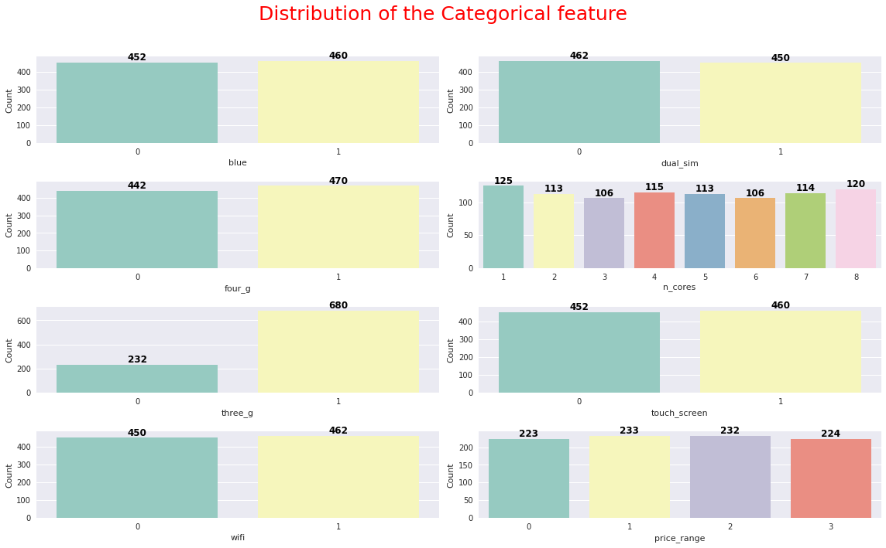
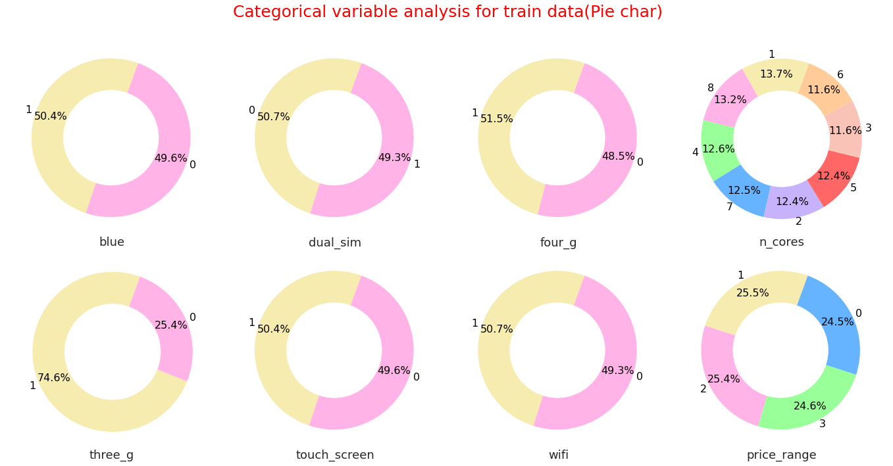
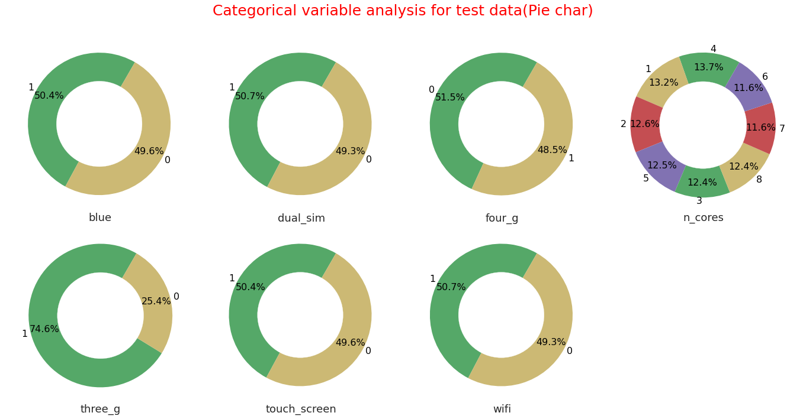
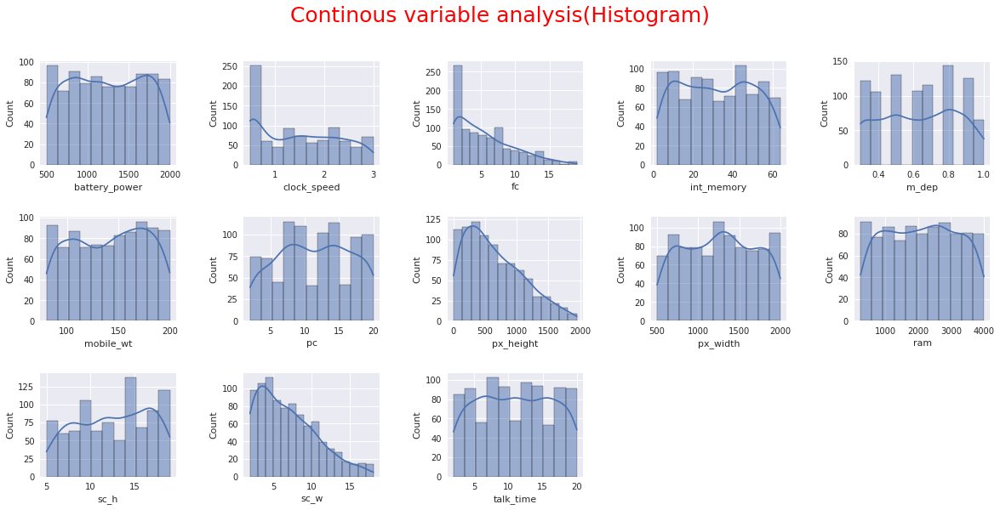
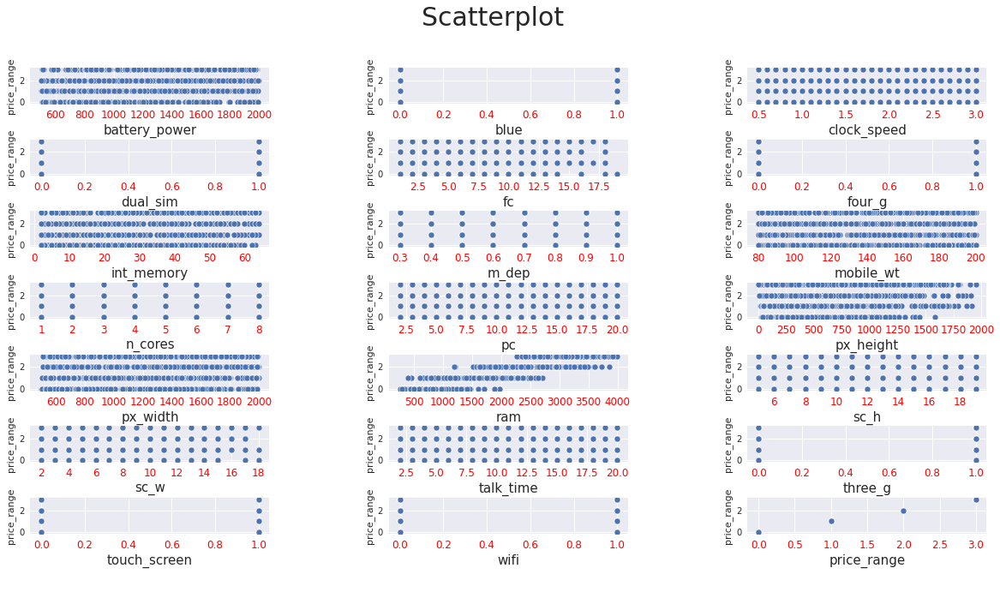
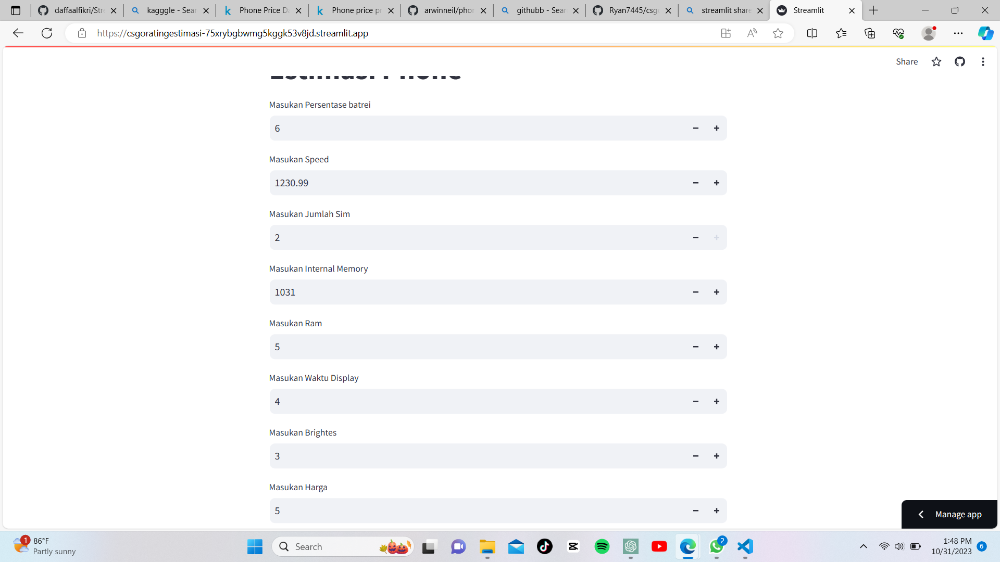

Laporan Proyek Machine Learning

### Nama : Ryan Anto Ramadhan

### Nim : 211351132

### Kelas : TIF Pagi B

## Domain Proyek

Pengembangan Aplikasi Mobile: Proyek-proyek ini berfokus pada pembuatan aplikasi untuk ponsel, baik untuk platform Android, iOS, atau kedua-duanya. Ini bisa mencakup pengembangan aplikasi bisnis, game, aplikasi kesehatan, atau aplikasi lainnya yang berbasis mobile.

## Business Understanding

Telepon adalah sarana komunikasi utama dalam bisnis. Memahami cara efektif menggunakan telepon untuk panggilan suara, pesan teks, dan email sangat penting untuk menjaga komunikasi yang baik dengan klien, pelanggan, dan kolega.

Banyak bisnis menggunakan sistem telepon untuk dukungan dan layanan pelanggan. Memahami cara mengatur dan mengelola pusat panggilan, hotline layanan pelanggan, dan sistem telepon otomatis sangat penting untuk memastikan pengalaman pelanggan yang baik

### Problem Statements

- Mencari harga Handphone
- Sebelum ke toko Handphone kita pastikan dahulu Estimasi Harga Dan Spesifik Handphone

### Goals

- Seseorang dapat mengetahui Harga Handphone dan spesifikasi Handphone.

### Solution statements

- Pengembangan sistem harga dan spesifikasi handphone

# Data Understanding

Dataset yang digunakan berasal dari situs Kaggle. Dataset ini mengandung Phone Price

[Dataset Kaggle](https://www.kaggle.com/datasets/parnianmalekian/phone-price-dataset)

### Variabel Variabel Pada Dataset Phone

- battery_power: Total energy a battery can store in mAh
- blue: Has bluetooth or not
- clock_speed: The speed at which the microprocessor executes instructions
- dual_sim: Has dual sim support or not
- fc: Front Camera mega pixels
- four_g: Has 4G or not
- int_memory: Internal Memory in Gigabytes
- m_dep: Mobile Depth in cm
- mobile_wt: Weight of mobile phone
- n_cores: Number of cores of the processor
- pc: Primary Camera megapixels
- px_height: Pixel Resolution Height
- px_width: Pixel Resolution Width
- ram: Random Access Memory in Megabytes
- sc_h: Screen Height of mobile in cm
- sc_w: Screen Width of mobile in cm
- talk_time: Longest time that battery will last by a call
- three_g: Has 3G or not
- touch_screen: Has touch screen or not
- wifi: Has wifi or not







## Data Preparation

Pertama-tama import semua library yang dibutuhkan,

```bash
import pandas as pd
import numpy as np
import matplotlib.pyplot as plt
import seaborn as sns
```

Dan Uupload file Kaggle.json

```bash
from google.colab import files
files.upload()
```

Kita cek terlebih dahulu masuk atau engga nya

```bash
!mkdir -p ~/.kaggle
!cp kaggle.json ~/.kaggle/
!chmod 600 ~/.kaggle/kaggle.json
!ls ~/.kaggle
```

Dan kita download terlebih dahulu secara otomatis

```bash
!kaggle datasets download -d parnianmalekian/phone-price-dataset/code
```

Dan kita unzip terlebih dahulu file nya

```bash
!unzip Phoneprice -d phone
!ls phone
```

kita cek dataset nya

```bash
df = pd.read_csv("/content/train.csv")
```

Cek Variabel dataset

```bash
df.head()
```

Kita lihat info varibael tersebut

```bash
df.info()
```

```bash
df.isna().sum()
```

```bash
plt.figure(figsize=(10,8))
sns.heatmap(df.corr(),annot=True)
```

```bash
df.head()
```

```bash
df.info()
```

## Features

Semua kolom tidak memiliki nilai dan memiliki kolom dan tidak mengandung syntax

Feature bisa di gunakan menghitung parameter estimasi

```bash
features = ['battery_power','blue','clock_speed','dual_sim','fc','four_g','int_memory','m_dep']
x = df[features]
y = df['blue']
x.shape, y.shape
```

```bash
from sklearn.model_selection import train_test_split
x_train, x_test, y_train, y_test = train_test_split(x,y,random_state=90,test_size=0.5)
y_test.shape
x_train.shape
```

```bash
x_test.shape
```

## Modeling

sebelumnya mari kita import library yang nanti akan digunakan,

```bash
from sklearn.linear_model import LinearRegression
lr = LinearRegression()
lr.fit(x_train,y_train)
pred = lr.predict(x_test)
```

Lalu berikut adalah skor akurasi dari model yang kita buat

```bash
score = lr.score(x_test,y_test)
print('Akurasi model Regresi Linear', score)
```

Akurasi model Regresi Linear 0.9731484719675603

```bash
print(x)
```

```bash
input_data = np.array([[842,0,2.2,0,1,0,7,0.6]])

prediction = lr.predict(input_data)
print('Estimasi Phone :',prediction)
print('Nilai Phone : 6')
```

## Evaluation

Hitung R-kuadrat (R^2): Untuk menghitung R-kuadrat, Anda dapat menggunakan rumus berikut:

R^2 = 1 - (SSR / SST)

SSR (Sum of Squared Residuals) adalah jumlah perbedaan kuadrat antara nilai aktual dan nilai prediksi.
SST (Total Sum of Squares) adalah jumlah perbedaan kuadrat antara nilai aktual dan rata-rata nilai aktual

Rumus :

RMSE = sqrt((1/n) \* Σ(aktual - diprediksi)^2)

```bash
from sklearn.metrics import r2_score
from sklearn.metrics import mean_squared_error

print('R2:', r2_score(y_test,pred))
print('RMSE:', np.sqrt(mean_squared_error(y_test, pred)))
```

# Deployment


[Estimasi Phone](https://csgoratingestimasi-75xrybgbwmg5kggk53v8jd.streamlit.app/)
